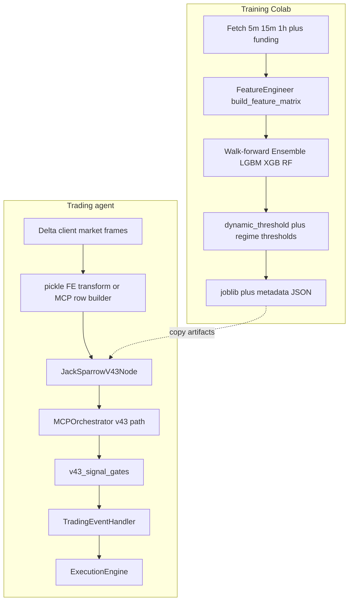

# JackSparrow: notebook training ↔ trading agent integration

## Purpose

- **Notebook** ([`notebooks/JackSparrow_v44_all_fixes(1).ipynb`](../../notebooks/JackSparrow_v44_all_fixes(1).ipynb)): train, validate, optionally retrain gated models, export joblib + metadata.
- **Repo**: load artifacts, rebuild the same feature vector on live candles (+ funding), run ensemble inference, expose **explainable scalars**, apply **gates** consistent with TP/SL/fee/leverage assumptions, emit decisions for execution.

Naming note: filename says “v44”, but the notebook exports **`MODEL_VERSION = 'v43'`** (`model_artifact_v43.pkl`, `metadata_v43.json`). Production uses **`JackSparrowV43Node`** — there is **no separate v44 discovery path** until you intentionally add one.

---

## End-to-end flow

---

## Layer A — Training contract (notebook)

These are the **authoritative definitions** Colab fixes to when debugging “model vs agent mismatch”:

- **Venue**: Delta India `BTCUSD` REST (`BASE_URL` in notebook).
- **Fetch scale**: `TARGET_CANDLES_5M = 60_000`, `15m = 20_000`, `1h = 10_000`, `TARGET_FUNDING_BARS = 5_025`.
- **Target (regression path, default)**: **`USE_ATR_TARGET = False`**. Continuous label uses **simple** forward return over **`TP_SL_TARGET_HORIZON = 120`** five-minute bars (~10 hours):  
  `close.shift(-120) / close - 1.0`.  
  **Ignore the phrase “log-return” in notebook comments — the implemented math is not log.**
- **Features**: ordered **`FEATURE_COLS_V25`** — **40** columns (legacy markdown in the notebook may still say “38”; **40** matches [`metadata_v43.json`](../../agent/model_storage/JackSparrow_v43_models_BTCUSD/metadata_v43.json)).
- **Model**: **`USE_ENSEMBLE_MODELS = True`** (LGBM + XGB + RF); **`USE_CONFIDENCE_ESTIMATION = True`** (spread across members); **`USE_REGIME_MODELS = True`** trains regime-specific heads / thresholds when enabled.
- **Signal threshold**: base `SIGNAL_THRESHOLD = 0.012`; with **`USE_DYNAMIC_THRESHOLD = True`**, walk-forward OOF sets **`dynamic_threshold`** (often ~0.0109–0.011 at **`THRESHOLD_OOF_PERCENTILE = 75`**). Runtime must use **resolved threshold from artifact + `get_signal_threshold`**, not the raw 0.012 constant alone.
- **Retrain quality gates (OOS)**: Win rate ≥ **74%**, Sharpe ≥ **1.0**, IC ≥ **0.03**, return ≥ **0%** (`RETRAIN_VALIDATION_*`).
- **Execution-aligned knobs** (for backtest / gate philosophy): `TAKE_PROFIT_PCT = 0.015`, `STOP_LOSS_PCT = 0.01`, `LEVERAGE = 3`, `MAX_TRADES_PER_HOUR = 2`, `TRADE_DEBOUNCE_BARS = 6`, `MAX_TRADES_PER_DAY = 6`, `MIN_EDGE_COST_RATIO = 1.5`.
- **Direction**: **`LONG_ONLY_EXECUTION = True`**, **`ENABLE_SHORT_EXECUTION = False`**. `SIGNAL_THRESHOLD_SHORT` exists in config for symmetry of the *regression score* but **shorts are not trained for live execution** in this profile.
- **Repo hook**: `TRADING_AGENT_ROOT` enables importing **`agent.data.candle_validation.validate_candles`** inside Colab for stricter fetch QA.

---

## Layer B — Runtime contract (this repository)

- **Frames**: [`agent/core/v43_market_frames.py`](../../agent/core/v43_market_frames.py) fetches 5m / 15m / 1h + funding via `jacksparrow_v43_candles_*` (defaults **much smaller** than training — enough for indicator warmup if transforms match).
- **Primary feature path**: exported pickle **`feature_engineer.transform(...)`** inside [`agent/models/jack_sparrow_v43_node.py`](../../agent/models/jack_sparrow_v43_node.py). **This must match training** for production decisions.
- **Secondary path**: [`feature_store/jacksparrow_v43_mcp_row.py`](../../feature_store/jacksparrow_v43_mcp_row.py) — per-feature HTTP/MCP; verify parity before treating it as authoritative.
- **Inference output (context `format: jacksparrow_v43`)**:
  - **`expected_return`**: same scale as training target (**simple** forward return prediction, not probability).
  - **`threshold`**: from [`jacksparrow_v43_inference.get_signal_threshold`](../../agent/models/jacksparrow_v43_inference.py), respecting **`dynamic_threshold`**, regime dict quirks, env floor `JACKSPARROW_V43_SIGNAL_THRESHOLD_FLOOR`.
  - **`regime`**, **`uncertainty`**, **`unc_scale`**: regime routing + ensemble disagreement scaling.
  - **`prediction`** on MCP envelope: legacy **−1…1** `tanh` mapping for older consumers — **prefer `expected_return` + `threshold` for human-readable “sensemaking”.**
- **Decision**: [`agent/core/mcp_orchestrator.py`](../../agent/core/mcp_orchestrator.py) `_process_jacksparrow_v43_prediction`: **`raw_long = expected_return > threshold`**, then [`agent/core/v43_signal_gates.py`](../../agent/core/v43_signal_gates.py) (debounce, trade caps, optional block trending, gate 5 min edge vs fees/TP/leverage).
- **Adaptive retrains**: [`agent/learning/adaptive/adaptive_controller.py`](../../agent/learning/adaptive/adaptive_controller.py) skips automatic v15-style retrains for v43 dirs — **new weights come from Colab export + artifact swap.**

---

## How the agent should “reason” about the model

1. **Economics**: Compare **`expected_return`** to **`threshold`** on **simple-return** units (e.g. 0.011 = ~1.1% predicted move over the trained horizon — not the same as instantaneous PnL).
2. **Calibration**: Threshold is often **below** static 0.012 after OOF percentile calibration; seeing ~0.011 is normal if `dynamic_threshold` was saved.
3. **Confidence**: Larger **uncertainty** (ensemble std) → smaller **`unc_scale`** → smaller effective size hints (see node + orchestrator).
4. **Regime**: Crisis / routing logic may flatten or swap sub-models; conclusions must cite **`regime`** from context.
5. **Why HOLD**: Always thread **gate reject reason** (threshold, debounce, cap, min edge, block trending) into logs/UI — not only “below threshold”.
6. **No phantom shorts**: Negative `expected_return` does not imply a short **unless** you later enable a full short execution stack.

---

## Known mismatches / watchlist

- **Training history length vs live window** — if live indicators drift from Colab parity, widen `jacksparrow_v43_candles_*` or run a tail-diff test on saved candles.
- **Comment vs math on target** — any doc stating “log-return” should be corrected to **simple return**.
- **`MODEL_VERSION`** vs notebook filename — avoid assuming “v44 bundle” implies new loader logic.

---

## Phased actions (prioritized)

**P0 — correctness on promotion**

- [ ] **artifact-parity**: After every export — assert `features` list **order/count** equals `FEATURE_COLS_V25`; spot-check one row vs Colab `transform` on identical OHLCV; confirm `dynamic_threshold` and regime artifacts load.
- [ ] Run targeted tests: `tests/unit/test_jacksparrow_v43_*`, `test_jack_sparrow_v43_node*`.

**P1 — observability**

- [ ] **canonical-fields-ui-logs**: Surfaces expose `expected_return`, `threshold`, `regime`, `uncertainty`, final gate reason; discourage showing only MCP `prediction` tanh.

**P2 — optional product change**

- [ ] **short-path**: Only if notebooks set `ENABLE_SHORT_EXECUTION` and risk accepts shorts — mirror negative threshold in orchestrator, handler, sizing, exchange adapter.

---

## Key file index

| Role | Path |
|------|------|
| Training notebook | [`notebooks/JackSparrow_v44_all_fixes(1).ipynb`](../../notebooks/JackSparrow_v44_all_fixes(1).ipynb) |
| v43 MCP row (HTTP parity) | [`feature_store/jacksparrow_v43_mcp_row.py`](../../feature_store/jacksparrow_v43_mcp_row.py) |
| Inference node | [`agent/models/jack_sparrow_v43_node.py`](../../agent/models/jack_sparrow_v43_node.py) |
| Threshold resolution | [`agent/models/jacksparrow_v43_inference.py`](../../agent/models/jacksparrow_v43_inference.py) |
| Orchestrator path | [`agent/core/mcp_orchestrator.py`](../../agent/core/mcp_orchestrator.py) |
| Gates | [`agent/core/v43_signal_gates.py`](../../agent/core/v43_signal_gates.py) |
| Live frames | [`agent/core/v43_market_frames.py`](../../agent/core/v43_market_frames.py) |
| Settings | [`agent/core/config.py`](../../agent/core/config.py) |
| Trading bridge | [`agent/events/handlers/trading_handler.py`](../../agent/events/handlers/trading_handler.py) |
| WS fields | [`backend/services/agent_event_subscriber.py`](../../backend/services/agent_event_subscriber.py) |
| Shipped metadata sample | [`agent/model_storage/JackSparrow_v43_models_BTCUSD/metadata_v43.json`](../../agent/model_storage/JackSparrow_v43_models_BTCUSD/metadata_v43.json) |
