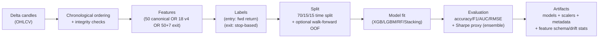

# Trading Agent 2 — Complete ML Pipeline & Data Flow (Code-Traced)

Project root: `D:\ATTRAL\Projects\Trading Agent 2`

This report reconstructs the *actual* ML pipeline and data flow as implemented in code. It is based on reading and tracing the runtime agent path (events → features → models → reasoning → trading → execution) and the available training scripts + stored model metadata/artifacts.

---

## 1) System architecture diagram (text)

```mermaid
flowchart TD
  DeltaREST["DeltaExchange REST API\n/v2/history/candles\n/v2/tickers/{symbol}\n/v2/l2orderbook/{symbol}\n/v2/orders"] --> DeltaClient["agent/data/delta_client.py\nDeltaExchangeClient\n(circuit breaker + HMAC auth)"]
  DeltaWS["DeltaExchange WebSocket\nv2/ticker"] --> DeltaWSClient["agent/data/delta_client.py\nDeltaExchangeWebSocketClient"]

  DeltaClient --> MarketData["agent/data/market_data_service.py\nMarketDataService\n(REST+cache+event emission)"]
  DeltaWSClient --> MarketData

  MarketData -->|publish| EventBus["agent/events/event_bus.py\nEventBus (Redis Streams)\n+ DLQ/retry"]

  EventBus --> MarketHandler["agent/events/handlers/market_data_handler.py\nMarketDataEventHandler"]
  MarketHandler -->|FeatureRequestEvent| EventBus

  EventBus --> FeatureServer["agent/data/feature_server.py\nMCPFeatureServer"]
  FeatureServer -->|get_market_data(limit=100)| MarketData
  FeatureServer --> FeatureEng["agent/data/feature_engineering.py\nFeatureEngineering.compute_feature\n(per-feature)"]
  FeatureServer -->|FeatureComputedEvent| EventBus

  EventBus --> FeatureHandler["agent/events/handlers/feature_handler.py\nFeatureEventHandler"]
  FeatureHandler -->|ModelPredictionRequestEvent| EventBus

  EventBus --> Orchestrator["agent/core/mcp_orchestrator.py\nMCPOrchestrator\n(authoritative coordinator)"]
  Orchestrator -->|get_features| FeatureServer
  Orchestrator --> ModelRegistry["agent/models/mcp_model_registry.py\nMCPModelRegistry\n(consensus engine)"]
  ModelRegistry --> ModelNodes["agent/models/*_node.py\nV4EnsembleNode\nXGBoostNode / LightGBMNode / RandomForestNode\n(+ RobustEnsembleNode exists, not in default discovery)"]
  Orchestrator --> Reasoning["agent/core/reasoning_engine.py\nMCPReasoningEngine\n(6-step chain)"]
  Orchestrator -->|DecisionReadyEvent| EventBus

  EventBus --> TradingHandler["agent/events/handlers/trading_handler.py\nTradingEventHandler\n(gates + sizing + SL/TP)"]
  TradingHandler -->|RiskApprovedEvent| EventBus

  EventBus --> Execution["agent/core/execution.py\nExecutionEngine\n(execute + manage positions)"]
  Execution -->|paper fills via ticker| DeltaClient
  Execution -->|live orders| DeltaClient
```

---

## 2) File-by-file responsibility mapping (core pipeline)

### Agent entrypoints / orchestration
- `agent/core/intelligent_agent.py`
  - Bootstraps the system: initializes `event_bus`, `mcp_orchestrator`, `market_data_service`, registers handlers, and starts market-data streaming in `MONITORING` mode.
  - Handles backend commands via Redis queue (`predict`, `execute_trade`, `get_status`).
- `agent/core/mcp_orchestrator.py`
  - **Authoritative** ML pipeline coordinator:
    1) requests features from `MCPFeatureServer`
    2) requests predictions from `MCPModelRegistry`
    3) generates reasoning via `MCPReasoningEngine`
    4) emits `DecisionReadyEvent` (and stores decision context in vector memory when enabled)

### Data ingestion (Delta Exchange)
- `agent/data/delta_client.py`
  - REST endpoints:
    - `get_candles()` → `/v2/history/candles`
    - `get_ticker()` → `/v2/tickers/{symbol}`
    - `get_orderbook()` → `/v2/l2orderbook/{symbol}`
    - `place_order()` → `/v2/orders`
  - WebSocket: `DeltaExchangeWebSocketClient` subscribes to `v2/ticker`
  - Circuit breaker, request signing (HMAC), timestamp drift handling.
- `agent/data/market_data_service.py`
  - Fetches candles/ticker/orderbook via `DeltaExchangeClient`
  - Emits events:
    - `MarketTickEvent` (UI updates, plus optional SL/TP checks)
    - `PriceFluctuationEvent` (major move triggers ML pipeline)
    - `CandleClosedEvent` (completed candle triggers ML pipeline)
  - Candle close detection is based on REST candle lists and uses **second-to-last candle** to avoid emitting the still-forming bar.
  - **Caching**: uses Redis cache (`agent/core/redis_config.py` `get_cache/set_cache`) for market data and tickers.

### Event bus & handlers
- `agent/events/event_bus.py`
  - Redis Streams-based pub/sub with consumer group, DLQ, retries.
- `agent/events/handlers/market_data_handler.py`
  - On `CANDLE_CLOSED` and `PRICE_FLUCTUATION`:
    - updates context
    - publishes `FeatureRequestEvent`
  - Feature list selection:
    - **Prefer** `mcp_orchestrator.model_registry.get_required_feature_names()` (model-driven requirements)
    - Fallback: canonical list from `agent/data/feature_list.py`
- `agent/events/handlers/feature_handler.py`
  - On `FEATURE_COMPUTED`, publishes `ModelPredictionRequestEvent` with `context.current_price`.
- `agent/events/handlers/model_handler.py`
  - Receives `ModelPredictionCompleteEvent`
  - Skips reasoning if orchestrator already emitted a decision, otherwise publishes `ReasoningRequestEvent`.
  - (In the current architecture, orchestrator is designed to be the decision source.)
- `agent/events/handlers/trading_handler.py`
  - Consumes `DecisionReadyEvent` and gates trade entry:
    - HOLD/no-signal skip
    - staleness check (`MAX_SIGNAL_AGE_SECONDS`)
    - confidence threshold (`MIN_CONFIDENCE_THRESHOLD`)
    - requires `features.volatility` (rejects if missing)
    - optional MTF filter using `trend_15m`
    - ADX ranging filter (`adx_14 < 20` blocks mild BUY/SELL)
  - Computes size via `risk_manager.calculate_position_size(...)`
  - Publishes `RiskApprovedEvent` with optional ATR-based SL/TP.

### Feature engineering (train + live)
- `agent/data/feature_engineering.py`
  - `FeatureEngineering.compute_feature(feature_name, candles)` (async)
  - Validates OHLCV integrity and computes indicator values per feature.
  - Supports both canonical features and v4-only features/aliases:
    - aliases: `bb_pct` → `bb_position`, `macd_hist` → `macd_histogram`
    - v4 extras: `ema_cross`, `atr_pct`, `returns_1`, `vol_zscore`, `vol_ratio`, etc.
- `agent/data/feature_list.py`
  - Canonical **50-feature** list + order and `EXPECTED_FEATURE_COUNT`.
- `feature_store/feature_registry.py`
  - Canonical **50-feature** list + order, schema utilities for `feature_schema.json`.
- `feature_store/feature_pipeline.py`
  - Vectorized batch implementation of the canonical 50 features:
    - `compute_features(df, resolution_minutes, fill_invalid)`
    - `FeaturePipeline.transform(df)` asserts **order == FEATURE_LIST** and **count == 50**.
- `feature_store/feature_cache.py`
  - Rolling candle window cache (deque) and `get_latest_feature_vector()` returning ordered 50-vector.
  - NOTE: The runtime MCP feature server does **not** use this; it uses per-feature computation.

### Models, registry, discovery
- `agent/models/mcp_model_registry.py`
  - Runs each model node’s `predict()` in parallel (per-model timeout)
  - Filters predictions by health status (healthy → unknown → degraded)
  - Computes consensus via `AdvancedConsensusEngine` (fallback to simple average if consensus fails)
  - `get_required_feature_names()` returns union of model-required features, preserving first-seen order.
- `agent/models/model_discovery.py`
  - **Current effective behavior: v4-only discovery**
    - Scans `MODEL_DIR` for `metadata_BTCUSD_*.json`
    - Loads `V4EnsembleNode.from_metadata(meta_path)`
  - Legacy find/load methods exist but are not the primary branch in `discover_models()`.
- Model nodes
  - `agent/models/v4_ensemble_node.py`
    - Loads joblib entry+exit classifiers and scalers from v4 metadata.
    - Builds feature vector in metadata order using `request.context["feature_names"]`.
    - Produces entry signal \([-1,+1]\) and attaches exit signal in `prediction.context`.
  - `agent/models/xgboost_node.py`, `lightgbm_node.py`, `random_forest_node.py`
    - Expect **50** features (canonical schema) and normalize outputs to \([-1,+1]\).
    - Regressor outputs are converted into return-like signal using `current_price` from context.
  - `scripts/robust_ensemble_node.py` (exposed via `agent/models/robust_ensemble_node.py`)
    - Robust stacking ensemble inference node (entry+exit + drift + optional regime routing).
    - Exists in repo, but not wired into default v4-only discovery path.

### Execution
- `agent/core/execution.py`
  - Subscribes to `RISK_APPROVED` and executes paper or live.
  - Paper fills use ticker from Delta (`_get_fill_price_paper`), with staleness checks and fallback to context price.
  - Manages SL/TP and trailing stops, emits `OrderFillEvent` and `PositionClosedEvent`.

---

## 3) DATA FLOW PIPELINE (end-to-end)

### 3.1 Live agent: raw market data → features → model input → decision → execution

**Step-by-step data flow**

1) **Data source**
   - Delta Exchange REST:
     - candles: `/v2/history/candles` (`DeltaExchangeClient.get_candles`)
     - ticker: `/v2/tickers/{symbol}` (`DeltaExchangeClient.get_ticker`)
   - Delta Exchange WebSocket:
     - ticker stream `v2/ticker` (`DeltaExchangeWebSocketClient.subscribe_ticker`)

2) **Preprocessing / normalization**
   - `MarketDataService.get_market_data(symbol, interval, limit)`:
     - resolves `resolution`
     - computes `(start_time, end_time)` from limit
     - calls `delta_client.get_candles(...)`
     - formats candles to list of dicts with keys:
       - `timestamp`, `open`, `high`, `low`, `close`, `volume`
   - Emits:
     - `CandleClosedEvent` with the completed bar’s OHLCV
     - `PriceFluctuationEvent` if the move exceeds threshold

3) **Storage**
   - **No durable candle storage** (no parquet/CSV/DB for candles in the core pipeline).
   - Short-lived caching:
     - Redis cache for `market_data:*` and `ticker:*` keys (`get_cache/set_cache`), TTL ~60s (market data), ~10s (ticker).
   - In-memory caches inside `MarketDataService` (last ticker/candle per symbol).

4) **Feature generation (live)**
   - Trigger: `CandleClosedEvent` or `PriceFluctuationEvent`
   - `MarketDataEventHandler` chooses `feature_names`:
     - model-driven (registry required features) or canonical fallback 50.
   - `MCPFeatureServer.get_features()`:
     - fetches last 100 candles via `market_data_service.get_market_data(limit=100)`
     - for each requested feature name: `FeatureEngineering.compute_feature(name, candles)`
     - returns list of `MCPFeature {name, value, quality}` **preserving request order**

5) **Model input**
   - Orchestrator calls model registry with:
     - `features`: list[float] in the exact order returned by feature server
     - `context.feature_names`: list[str] aligned with feature values
     - `context.current_price`: used for regressor normalization

6) **Inference and decision**
   - `MCPModelRegistry.get_predictions()` calls each node’s `predict(...)`
   - Orchestrator builds `market_context`:
     - `features` as dict `{name: value}`
     - derived `volatility` when only `volatility_10/20` exist
     - optional `trend_15m` derived from recent 15m closes when enabled
   - `MCPReasoningEngine.generate_reasoning()` produces conclusion + calibrated confidence
   - Orchestrator emits `DecisionReadyEvent` with `reasoning_chain.market_context.features` used by trading handler.

7) **Execution**
   - `TradingEventHandler` gates and publishes `RiskApprovedEvent`
   - `ExecutionEngine` executes orders (paper/live), opens position, monitors SL/TP/trailing stop, closes positions.

**Flow summary (live)**

DeltaExchange (REST/WS) → `MarketDataService` → (Redis cache + in-memory cache) → events (`CANDLE_CLOSED` / `PRICE_FLUCTUATION`) → `MCPFeatureServer` → `FeatureEngineering` → ordered feature vector → `MCPModelRegistry` → `MCPReasoningEngine` → `DecisionReadyEvent` → `TradingEventHandler` → `ExecutionEngine` → DeltaExchange orders (live) or simulated fills (paper).

---

### 3.2 Training: raw market data → in-memory dataset → features → labels → model → artifacts

There are multiple training scripts; none implement persistent candle storage as a primary artifact.

**Common pattern**
- Fetch candles from Delta (REST auth client or public endpoint)
- Keep candles in memory (list of dicts or DataFrame)
- Compute features
- Create labels (forward returns or stop-based exit)
- Chronological splits (and sometimes walk-forward OOF)
- Save models + metadata to disk

---

## 4) FEATURE ENGINEERING PIPELINE

### 4.1 Where features are created

**Live MCP feature computation (per-feature, candle-window based)**
- `agent/data/feature_engineering.py`
  - `FeatureEngineering.compute_feature(feature_name: str, candles: List[Dict]) -> float`
  - Called by `agent/data/feature_server.py` `MCPFeatureServer._compute_feature(...)`.

**Canonical batch (vectorized) feature computation**
- `feature_store/feature_pipeline.py`
  - `compute_features(df, resolution_minutes, fill_invalid)` → DataFrame with columns in canonical order.
  - `FeaturePipeline.transform(df)` validates count and order.
- `feature_store/feature_cache.py`
  - Rolling window and last-row extraction for live inference where used.

### 4.2 Full list of features used

#### Canonical schema: 50 features (order enforced)
Source: `agent/data/feature_list.py`, `feature_store/feature_registry.py`, `models/feature_list.json`

1. `sma_10`
2. `sma_20`
3. `sma_50`
4. `sma_100`
5. `sma_200`
6. `ema_12`
7. `ema_26`
8. `ema_50`
9. `close_sma_20_ratio`
10. `close_sma_50_ratio`
11. `close_sma_200_ratio`
12. `high_low_spread`
13. `close_open_ratio`
14. `body_size`
15. `upper_shadow`
16. `lower_shadow`
17. `rsi_14`
18. `rsi_7`
19. `stochastic_k_14`
20. `stochastic_d_14`
21. `williams_r_14`
22. `cci_20`
23. `roc_10`
24. `roc_20`
25. `momentum_10`
26. `momentum_20`
27. `macd`
28. `macd_signal`
29. `macd_histogram`
30. `adx_14`
31. `aroon_up`
32. `aroon_down`
33. `aroon_oscillator`
34. `trend_strength`
35. `bb_upper`
36. `bb_lower`
37. `bb_width`
38. `bb_position`
39. `atr_14`
40. `atr_20`
41. `volatility_10`
42. `volatility_20`
43. `volume_sma_20`
44. `volume_ratio`
45. `obv`
46. `volume_price_trend`
47. `accumulation_distribution`
48. `chaikin_oscillator`
49. `returns_1h`
50. `returns_24h`

#### v4 schema: 18 features (metadata-defined order)
Source: `agent/model_storage/jacksparrow_v4_BTCUSD/metadata_BTCUSD_*.json`

- `ema_9`
- `ema_21`
- `macd`
- `macd_signal`
- `atr_14`
- `macd_hist` (alias of macd histogram)
- `adx_14`
- `rsi_14`
- `vol_zscore`
- `vol_ratio`
- `bb_pct` (alias of bb_position)
- `bb_width`
- `roc_20`
- `roc_10`
- `ema_cross`
- `returns_1`
- `atr_pct`
- `volatility_20`

### 4.3 How features are computed

**Per-feature (live MCP feature server)**
- `FeatureEngineering.compute_feature()` implements each indicator directly.
- Uses the full candle window (up to last 100 candles provided by feature server) and usually returns the latest scalar value.
- Important computed forms/aliases:
  - `bb_pct` is computed using the same method as `bb_position`
  - `macd_hist` is computed using the same method as `macd_histogram`
  - `ema_cross = ema_9 - ema_21`
  - `atr_pct = atr_14 / close * 100`
  - `returns_1` is 1-bar return (%)
  - `vol_zscore` is volume z-score vs last 20

**Vectorized (feature_store)**
- `feature_store/feature_pipeline.compute_features(df, resolution_minutes)`
  - Uses rolling windows and pandas ewm; returns a full feature matrix.
  - Replaces NaN/Inf with 0 when `fill_invalid=True`.
  - Returns are resolution-dependent:
    - `returns_1h` uses `bars_1h = 60 // resolution_minutes`
    - `returns_24h` uses `bars_24h = 24*60 // resolution_minutes`

### 4.4 Feature transformations (scaling / normalization)

- **Canonical 50-feature models** (`XGBoostNode`, `LightGBMNode`, `RandomForestNode`)
  - No scaler applied in node code; raw engineered features are used.
- **Robust stacking ensemble v3**
  - Trains and saves `RobustScaler` for entry and exit feature matrices (`entry_scaler_*.joblib`, `exit_scaler_*.joblib`).
  - `RobustEnsembleNode` can use these at inference.
- **v4 ensembles**
  - Metadata references scalers (`entry_scaler_BTCUSD_*.joblib`, `exit_scaler_BTCUSD_*.joblib`)
  - `V4EnsembleNode` applies them if load succeeds.

### 4.5 Feature order in training and inference

- **Canonical 50**: strict order enforced by:
  - `feature_store.FeaturePipeline.transform()` (raises if order/count mismatch)
  - training scripts that use `FEATURE_LIST` explicitly
  - model nodes hard-check feature count == 50
- **v4**: order defined by metadata `features` list, and enforced by:
  - `MarketDataEventHandler` requesting registry-required features (model-driven list)
  - `V4EnsembleNode._build_feature_vector()` aligning by `context.feature_names`

### 4.6 Checks: duplication / missing features / order mismatches

**Duplication**
- Canonical feature list appears in multiple places but is identical:
  - `agent/data/feature_list.py`
  - `feature_store/feature_registry.py`
  - `models/feature_list.json`
  - and some scripts embed an identical local `FEATURE_LIST`.

**Missing features between training and inference**
- Canonical 50:
  - Training scripts (`train_models.py`, `train_price_prediction_models.py`, `train_xgboost_standalone.py`) all compute exactly these 50.
  - Inference nodes require exactly 50 (and will raise if mismatched).
- v4 18:
  - Live features are computed by `FeatureEngineering`, which implements all required v4 names/aliases.
  - The repository does **not** include v4 training code, so training-time feature math cannot be proven identical, only inferred from names/metadata.

**Order mismatch**
- Canonical: hard-failed by pipeline validation and/or node checks.
- v4: `V4EnsembleNode` aligns by names when `context.feature_names` is present; otherwise it slices first \(n\), which can hide upstream name/ordering bugs.

---

## 5) MODEL TRAINING ARCHITECTURE

### 5.1 Training pipeline diagram (generic)



### 5.2 `scripts/train_models.py` — XGBoost classifier (legacy canonical)
- **Models**: `xgboost.XGBClassifier` (3-class)
- **Task**: classification (SELL/HOLD/BUY)
- **Labels**: `create_labels(...)`
  - \(r = (close_{t+1} - close_t)/close_t * 100\)
  - BUY if \(r > 0.5\%\), SELL if \(r < -0.5\%\), else HOLD
  - Mapped for XGB: SELL→0, HOLD→1, BUY→2
- **Split**: chronological 70/15/15
- **Features**: per-candle rolling window with `FeatureEngineering.compute_feature()` across canonical 50
- **Artifacts**:
  - `models/xgboost_classifier_{symbol}_{tf}.pkl` (15m) and/or `agent/model_storage/xgboost/xgboost_classifier_{symbol}_{tf}.pkl` (others)
  - `models/training_summary.csv`

### 5.3 `scripts/train_price_prediction_models.py` — XGBoost regressor + classifier (+ optional LSTM)
- **Models**:
  - `xgboost.XGBRegressor` (regression)
  - `xgboost.XGBClassifier` (classification; binary if only 2 classes present, else 3-class)
  - optional LSTM (TensorFlow/Keras), sequence length 60
- **Tasks**:
  - regression: future close price
  - classification: SELL/HOLD/BUY using forward return thresholds
- **Splits**: chronological 70/15/15
- **Features**: canonical 50 via per-feature rolling window
- **Artifacts**:
  - `models/xgboost_regressor_{symbol}_{tf}.pkl` + copied to `agent/model_storage/xgboost/`
  - `models/xgboost_classifier_{symbol}_{tf}.pkl` + copied to `agent/model_storage/xgboost/`
  - `models/feature_list.json`
  - `models/price_prediction_training_summary.csv`

### 5.4 `scripts/train_xgboost_standalone.py` — standalone public API trainer
- **Data fetch**: public candles endpoint (`requests`), no auth
- **Features**: canonical 50 computed with `ta` library
- **Labels**: 0/1/2 SELL/HOLD/BUY by forward return thresholds
- **Split**: chronological 70/15/15
- **Artifacts**:
  - A **bundle dict** pickled:
    - `{model, feature_cols, symbol, timeframe, metrics, trained_at}`
  - Saved to `agent/model_storage/xgboost/xgboost_classifier_{symbol}_{tf}.pkl`

### 5.5 `scripts/train_robust_ensemble.py` — robust stacking ensemble v3
- **Models**:
  - Entry: stacking ensemble of XGBoost + RandomForest (+ LightGBM if available), calibrated, with XGBoost meta learner.
  - Exit: binary stacking ensemble similarly.
- **Task**:
  - Entry: 3-class (SELL/HOLD/BUY) based on forward return threshold.
  - Exit: binary (HOLD/EXIT) based on stop rules (loss/profit/time/volatility-adjusted).
- **Splits**:
  - Warmup trim (200 rows)
  - Chronological 70/15/15 (train/val/test)
  - Walk-forward OOF stacking using `TimeSeriesSplit(n_splits=n_folds)`
- **Feature sets**:
  - Entry: canonical 50
  - Exit: canonical 50 + **7 extras**
    - 4 simulated position-state features
    - 3 regime features (ADX/ATR-rank/vol-zscore)
- **Artifacts**:
  - Under output dir’s `xgboost/` (default `agent/model_storage/xgboost`):
    - `entry_base_{tag}.joblib`
    - `entry_meta_{tag}.joblib`
    - `entry_scaler_{tag}.joblib`
    - `exit_base_{tag}.joblib`
    - `exit_meta_{tag}.joblib`
    - `exit_scaler_{tag}.joblib`
    - `feature_importance_{tag}.json`
    - `feature_drift_{tag}.json`
    - `metadata_{tag}.json`
    - `MANIFEST.json`, `training_metadata.json`, `training_summary.csv`
  - Additionally writes “strict” names for the primary timeframe:
    - `entry_meta.pkl`, `exit_model.pkl`, `entry_base.pkl`, `exit_base.pkl`, `entry_scaler.pkl`, `exit_scaler.pkl`
    - `feature_schema.json`

### 5.6 Data leakage assessment (from code)
- All shown labelers are forward-looking (future close), but:
  - features are computed using candles up to and including the current index
  - splits are chronological
  - robust ensemble trims the tail rows where lookahead labels are invalid
- **No obvious train/test leakage** from the code paths inspected.

---

## 6) MODEL ARTIFACTS (what’s saved, where, schema/metadata)

### 6.1 v4 ensembles (production discovery path)
Folder: `agent/model_storage/jacksparrow_v4_BTCUSD/`

Per timeframe (e.g. `15m`, `1h`):
- `metadata_BTCUSD_{tf}.json`
  - schema: feature list (18 ordered), dataset hash/range, thresholds, metrics, library versions, artifact filenames.
- `features_BTCUSD_{tf}.json`
  - feature list file (redundant but explicit).
- `entry_model_BTCUSD_{tf}.joblib`
- `entry_scaler_BTCUSD_{tf}.joblib` (optional but present in metadata)
- `exit_model_BTCUSD_{tf}.joblib`
- `exit_scaler_BTCUSD_{tf}.joblib`

Loaded by: `agent/models/model_discovery.py` → `agent/models/v4_ensemble_node.py`.

### 6.2 Canonical XGBoost models
Folders:
- `models/` (primary outputs for scripts)
- `agent/model_storage/xgboost/` (agent storage, legacy)

Files:
- `models/feature_list.json` (canonical 50 schema export)
- `models/training_summary.csv`, `models/price_prediction_training_summary.csv`
- `agent/model_storage/xgboost/xgboost_classifier_{symbol}_{tf}.pkl` (either raw XGBClassifier pickle or bundle dict depending on trainer)
- `models/xgboost_classifier_{symbol}_{tf}.pkl`, `models/xgboost_regressor_{symbol}_{tf}.pkl` (script outputs)

### 6.3 Robust ensemble v3 artifacts
Default output: `agent/model_storage/xgboost/` (note: despite being “robust ensemble”, trainer writes under `xgboost/` for strict agent contract)

Core:
- `entry_*_{tag}.joblib`, `exit_*_{tag}.joblib`, scalers
- `metadata_{tag}.json` includes:
  - features_required (canonical 50 list)
  - exit_feature_names (50 + 7)
  - drift baseline stats, dataset_sha256, train/val/test sizes, thresholds, Sharpe proxy + promotion decision
- `feature_schema.json` stored for primary timeframe
- `feature_drift_{tag}.json` distribution stats (mean/std/percentiles)

Inference node exists at: `scripts/robust_ensemble_node.py` (re-exported via `agent/models/robust_ensemble_node.py`).

---

## 7) INFERENCE PIPELINE (agent side)

### 7.1 Where models are loaded
- Startup: `agent/core/mcp_orchestrator.py.initialize()`:
  - creates `MCPModelRegistry()`
  - runs `ModelDiscovery(self.model_registry).discover_models()`
- `agent/models/model_discovery.py` currently discovers **v4 metadata files** under `MODEL_DIR`:
  - `metadata_BTCUSD_*.json` → `V4EnsembleNode`

### 7.2 Real-time feature generation
- Triggered by:
  - `CandleClosedEvent` (completed candle) and `PriceFluctuationEvent` (major move)
- Feature names requested are model-driven:
  - `MarketDataEventHandler._get_runtime_feature_names()` prefers `model_registry.get_required_feature_names()`.
- Computation:
  - `MCPFeatureServer.get_features()`:
    - fetches last 100 candles via `MarketDataService.get_market_data(limit=100)`
    - computes each requested feature via `FeatureEngineering.compute_feature()`

### 7.3 Prediction and signal generation
- v4:
  - Entry: `predict_proba` 3-class [SELL,HOLD,BUY]
    - `entry_signal = buy_prob - sell_prob` (range \([-1,+1]\))
    - confidence = max(probabilities)
  - Exit: `predict_proba` 2-class [HOLD,EXIT]
    - `exit_signal = exit_prob - hold_prob` (range \([-1,+1]\))
    - stored in `prediction.context`
- Canonical nodes:
  - Expect 50 features.
  - Classifier signals computed similarly (multi-class directional probability) or mapped class label.
  - Regressor signals normalized via return vs `current_price` and `tanh`.

### 7.4 Signal → execution wiring
- Orchestrator emits `DecisionReadyEvent` with:
  - `signal` in {BUY, SELL, STRONG_BUY, STRONG_SELL, HOLD}
  - `confidence`
  - `position_size`
  - `reasoning_chain.market_context.features` (critical for trading handler gates)
- `TradingEventHandler` gates and emits `RiskApprovedEvent`
- `ExecutionEngine` executes, opens positions, monitors SL/TP and closes.

---

## 8) ARCHITECTURE GAPS / CRITICAL ISSUES (code-evidenced)

### 8.1 Train vs live feature implementation drift (two code paths)
- Canonical 50 features are implemented in **two separate places**:
  - `agent/data/feature_engineering.py` (per-feature, used by MCPFeatureServer)
  - `feature_store/feature_pipeline.py` (vectorized, used by robust ensemble training and feature cache)
- They are intended to match but can drift mathematically over time.
  - If they diverge, training (feature_store) and inference (feature_engineering) can silently become inconsistent unless you run explicit parity tests.

### 8.2 v4 training code not present
- v4 inference is fully defined by:
  - v4 metadata + artifacts in `agent/model_storage/jacksparrow_v4_BTCUSD/`
  - `V4EnsembleNode` behavior
  - `FeatureEngineering` formulas for the 18 features
- The repository does **not** contain the v4 training script/code that produced those models.
  - You can validate schema/order from metadata, but cannot prove training-time indicator formulas match current runtime formulas from this repo alone.

### 8.3 Discovery mode mismatch: v4-only vs legacy/ensemble artifacts
- `ModelDiscovery.discover_models()` is explicitly “v4-only mode” and scans `metadata_BTCUSD_*.json`.
- Legacy model loaders (`XGBoostNode`, `LightGBMNode`, `RandomForestNode`) exist, and robust ensemble inference node exists, but are not loaded in the main discovery path unless you change discovery logic or provide v4 metadata for them.

### 8.4 No durable candle dataset persistence
- Training scripts fetch from Delta and build in-memory datasets; they do not persist raw candles.
- Live path caches briefly in Redis but does not store full historical datasets.
- Reproducibility relies on:
  - robust ensemble `dataset_sha256` (but still requires re-fetching the exact same candles)
  - v4 metadata dataset ranges/hashes (again, without persisted raw candles).

### 8.5 `XGBoostNode` mismatch logging bug (diagnostics reliability issue)
- In `agent/models/xgboost_node.py`, the feature-count mismatch branch tries to log `request.features.keys()` even though `request.features` is a `List[float]`.
  - The mismatch is still detected (via count), but the “missing feature names” diagnostic logic is not reliable.

### 8.6 v4 fallback alignment can hide upstream errors
- `V4EnsembleNode._build_feature_vector()`:
  - prefers name-based alignment using `context.feature_names`
  - **fallback** slices first \(n\) features if names missing/incomplete
- This fallback can mask upstream payload issues by producing a vector of the right length but wrong semantics.

---

## 9) Appendix: Key code references (high-signal)

### Live pipeline entrypoints
- Agent startup + wiring: `agent/core/intelligent_agent.py`
- Orchestrated prediction path: `agent/core/mcp_orchestrator.py`
- Market data stream + event emission: `agent/data/market_data_service.py`
- Feature server: `agent/data/feature_server.py`
- Feature formulas: `agent/data/feature_engineering.py`
- Trading gate + risk-approved event: `agent/events/handlers/trading_handler.py`
- Execution: `agent/core/execution.py`

### Training scripts
- Canonical XGB classifier: `scripts/train_models.py`
- XGB regressor+classifier (+LSTM optional): `scripts/train_price_prediction_models.py`
- Robust stacking ensemble v3: `scripts/train_robust_ensemble.py`
- Standalone public-API XGB: `scripts/train_xgboost_standalone.py`

### Model artifacts / metadata
- v4: `agent/model_storage/jacksparrow_v4_BTCUSD/metadata_BTCUSD_*.json`
- Canonical schema: `models/feature_list.json`

