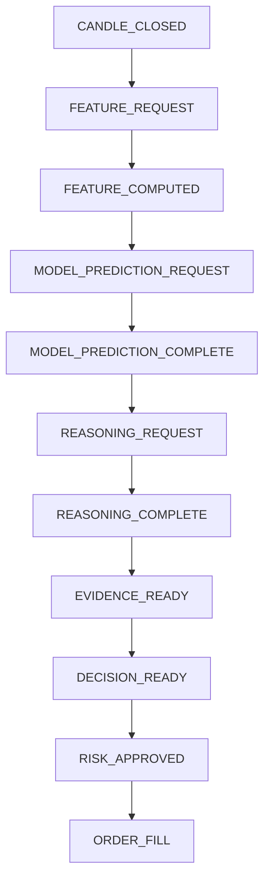

# Canonical events and handler wiring

Event type strings and payloads live in [`agent/events/schemas.py`](../agent/events/schemas.py) (`EventType`, Pydantic event classes). Serialization helpers: [`agent/events/utils.py`](../agent/events/utils.py). The bus: [`agent/events/event_bus.py`](../agent/events/event_bus.py) (Redis Streams, consumer groups, DLQ stream).

## Primary trading pipeline (happy path)

Orchestration details are split between [`agent/core/mcp_orchestrator.py`](../agent/core/mcp_orchestrator.py) (prediction + reasoning request handling) and handlers below.

## Handler registration order

Handlers are registered in [`agent/core/intelligent_agent.py`](../agent/core/intelligent_agent.py) (approximate sequence):

1. `market_data_handler.register_handlers()` — `MARKET_TICK`, `PRICE_FLUCTUATION`, `CANDLE_CLOSED`
2. `feature_handler.register_handlers()` — `FEATURE_COMPUTED` → publishes `MODEL_PREDICTION_REQUEST`
3. `model_handler.register_handlers()` — `MODEL_PREDICTION_COMPLETE`
4. `reasoning_handler.register_handlers()` — `REASONING_COMPLETE`, **`DECISION_READY`**
5. `trading_handler.register_handlers()` — **`DECISION_READY`** (trading path)

`REASONING_REQUEST` is handled only by **`mcp_orchestrator`** (single subscriber) so reasoning and policy-wrapped `DECISION_READY` are not duplicated.

### `EVIDENCE_READY`

Emitted by **`mcp_orchestrator` / agent policy** after ML inference (and optional reasoning) with an `MLEvidenceSnapshot` payload. Subscribers may use it for UI/diagnostics; trade intent still requires **`DECISION_READY`** → **`RISK_APPROVED`**.

### `DECISION_READY` fan-out

Both `ReasoningEventHandler` and `TradingEventHandler` subscribe to `DECISION_READY`. The event bus invokes subscribers in **registration order**: reasoning runs first, then trading. Do not rely on implicit ordering for correctness; keep handlers idempotent and use correlation IDs. If ordering becomes load-bearing, consolidate to a single subscriber or add an explicit pipeline stage event.

#### Self-awareness payload fields (optional, additive)

Populated by `mcp_orchestrator._enrich_decision_event_self_awareness` before publish when flags are enabled:

| Field | Description |
|-------|-------------|
| `agent_introspection` | Versioned read-only snapshot (`version`, `policy_signal`, `trade_score_pass`, `v43_regime`, `memory_context_count`, …). |
| `memory_context_id` | Vector store key for outcome backfill (`decision-{chain_id}-{ts}`). |
| `decision_event_id` | Same as `DecisionReadyEvent.event_id` for audit correlation. |

`TradingEventHandler` forwards `memory_context_id` and `agent_introspection` on `RISK_APPROVED` so execution can attach them to open positions.

### `POSITION_CLOSED` self-awareness

Before publish, `execution` calls `agent/core/agent_self_awareness_hooks.enrich_position_closed_payload`:

| Field | Description |
|-------|-------------|
| `reflection_snapshot` | Advisory post-trade critique (`advisory_only=true`, `quality_score`, `calibration_bucket`, `reason_codes`). |
| `memory_context_id` | Resolved after outcome backfill when lookup succeeds. |
| `agent_introspection_at_entry` | Copy of entry-time introspection from the open position. |
| `reasoning_chain_id`, `predicted_signal`, `confidence_at_entry` | Propagated for reflection and SQL metadata. |

Backend relays `reflection_snapshot` on the `agent_update` channel as `state=POSITION_REFLECTION` (see [Backend – WebSocket](06-backend.md#websocket-protocol)).

## Other important subscribers

| Component | Event types |
|-----------|-------------|
| [`agent/data/feature_server.py`](../agent/data/feature_server.py) | `FEATURE_REQUEST` |
| [`agent/core/execution.py`](../agent/core/execution.py) | `RISK_APPROVED` |
| [`agent/core/mcp_orchestrator.py`](../agent/core/mcp_orchestrator.py) | `MODEL_PREDICTION_REQUEST`, `REASONING_REQUEST` (owns reasoning + `EVIDENCE_READY` + `DECISION_READY` for these paths) |
| [`agent/core/state_machine.py`](../agent/core/state_machine.py) | `CANDLE_CLOSED`, `REASONING_COMPLETE`, `DECISION_READY`, `RISK_APPROVED`, `ORDER_FILL`, `RISK_ALERT`, `EMERGENCY_STOP`, `POSITION_CLOSED` |
| [`agent/models/mcp_model_registry.py`](../agent/models/mcp_model_registry.py) | Intentionally **does not** subscribe to `MODEL_PREDICTION_REQUEST` (orchestrator owns that to avoid duplicate prediction paths) |

## Adding a new event type

1. Add to `EventType` and define a `BaseEvent` subclass in `schemas.py`.
2. Document the producer and all consumers here.
3. Register handlers in one place per component; avoid duplicate `subscribe` for the same logical work.
