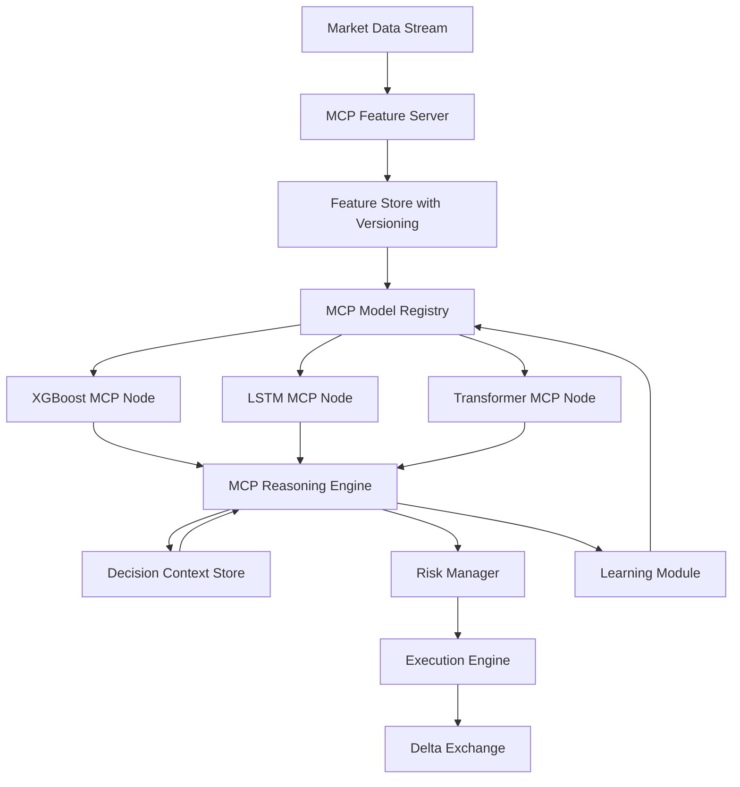

# AI Trading Agent - Enhanced Rebuild Specification
## Critical Analysis & Improvements with MCP Integration

---

## 🚨 IDENTIFIED ISSUES IN ORIGINAL SPEC

### 1. **Logical Errors**
- ❌ Health checks don't define what "degraded" means quantitatively
- ❌ No clear data pipeline from raw data → features → models → decisions
- ❌ "Learning" is mentioned but no actual learning mechanism specified
- ❌ WebSocket reconnection could cause message loss (no queue persistence)
- ❌ Circuit breaker logic doesn't handle partial failures well
- ❌ No versioning strategy for models or agent state
- ❌ Race conditions possible in multi-model voting system

### 2. **Missing Agent Intelligence**
- ❌ No reasoning chain - just weighted voting
- ❌ No memory of past decisions and outcomes
- ❌ No contextual awareness (market regime, volatility state)
- ❌ No self-reflection or confidence calibration
- ❌ No explanation generation for decisions

### 3. **Integration Gaps**
- ❌ No standardized protocol for model communication
- ❌ No model versioning or hot-swapping capability
- ❌ No centralized feature store architecture
- ❌ Backend-Agent communication is ad-hoc queues

---

## 🧠 ENHANCED ARCHITECTURE WITH MCP

### What is MCP (Model Context Protocol)?
MCP is a standardized protocol for AI systems to maintain context, communicate with models, and share information across services. We'll use it for:
- **Model Communication**: Standardized interface for all ML models
- **Context Management**: Persistent agent memory and reasoning chains
- **Feature Sharing**: Centralized feature store with versioning
- **Decision Auditing**: Full traceability of agent decisions

### Core MCP Components



---

## 📋 REWORKED SPECIFICATION FILES

### File 1: `01-mcp-architecture-specification.md`

```markdown
# MCP-Enhanced Architecture Specification

## System Architecture Overview

### Layer 1: Data & Context Layer
```
┌─────────────────────────────────────────┐
│  MCP Feature Server                      │
│  ├─ Real-time Data Ingestion            │
│  ├─ Feature Engineering Pipeline        │
│  ├─ Feature Versioning (Semantic)       │
│  └─ Feature Quality Monitoring          │
└─────────────────────────────────────────┘
         │
         ▼
┌─────────────────────────────────────────┐
│  TimescaleDB + Vector Store             │
│  ├─ OHLCV Data (TimescaleDB)            │
│  ├─ Computed Features (Partitioned)     │
│  ├─ Decision History (Embeddings)       │
│  └─ Market Regime States                │
└─────────────────────────────────────────┘
```

### Layer 2: Intelligence Layer (MCP-Based Agent)
```
┌─────────────────────────────────────────┐
│  MCP Model Registry                      │
│  ├─ Model Metadata & Versions           │
│  ├─ Performance Metrics Store           │
│  ├─ Model Health Status                 │
│  └─ A/B Testing Framework               │
└─────────────────────────────────────────┘
         │
         ▼
┌─────────────────────────────────────────┐
│  MCP Model Nodes (Containerized)        │
│  ├─ XGBoost Node (Signal Gen)           │
│  ├─ LSTM Node (Sequence Learning)       │
│  ├─ Transformer Node (Attention)        │
│  ├─ Regime Classifier (Market State)    │
│  └─ Risk Predictor (VaR, CVaR)          │
└─────────────────────────────────────────┘
         │
         ▼
┌─────────────────────────────────────────┐
│  MCP Reasoning Engine                   │
│  ├─ Context Window Manager              │
│  ├─ Multi-Model Consensus               │
│  ├─ Reasoning Chain Generator           │
│  ├─ Confidence Calibration              │
│  └─ Explanation Generator               │
└─────────────────────────────────────────┘
         │
         ▼
┌─────────────────────────────────────────┐
│  Decision Context Store                 │
│  ├─ Agent Memory (Vector DB)            │
│  ├─ Reasoning Chains                    │
│  ├─ Decision Outcomes                   │
│  └─ Performance Attribution             │
└─────────────────────────────────────────┘
```

### Layer 3: Execution & Monitoring Layer
```
┌─────────────────────────────────────────┐
│  Risk Management System                 │
│  ├─ Portfolio Risk Metrics              │
│  ├─ Position Sizing Engine              │
│  ├─ Circuit Breakers                    │
│  └─ Regime-Adaptive Risk Limits         │
└─────────────────────────────────────────┘
         │
         ▼
┌─────────────────────────────────────────┐
│  Execution Engine                       │
│  ├─ Order Management System             │
│  ├─ Slippage Modeling                   │
│  ├─ Delta Exchange Client (Resilient)  │
│  └─ Trade Logging                       │
└─────────────────────────────────────────┘
```

## MCP Protocol Specification

### 1. MCP Feature Protocol
```python
from enum import Enum
from typing import Dict, List, Optional
from pydantic import BaseModel
from datetime import datetime

class FeatureQuality(Enum):
    HIGH = "high"        # < 1% missing, fresh data
    MEDIUM = "medium"    # 1-5% missing, slightly stale
    LOW = "low"          # > 5% missing or very stale
    DEGRADED = "degraded"  # Significant quality issues

class MCPFeature(BaseModel):
    name: str
    version: str  # Semantic versioning: "1.2.3"
    value: float
    timestamp: datetime
    quality: FeatureQuality
    metadata: Dict[str, any]
    
class MCPFeatureRequest(BaseModel):
    feature_names: List[str]
    version: Optional[str] = "latest"
    symbol: str
    timestamp: Optional[datetime] = None
    
class MCPFeatureResponse(BaseModel):
    features: List[MCPFeature]
    request_id: str
    quality_score: float  # 0.0 to 1.0
    latency_ms: float
```

### 2. MCP Model Protocol
```python
class MCPModelPrediction(BaseModel):
    model_name: str
    model_version: str
    prediction: float  # -1.0 (strong sell) to +1.0 (strong buy)
    confidence: float  # 0.0 to 1.0
    reasoning: str  # Human-readable explanation
    features_used: List[str]
    computation_time_ms: float
    timestamp: datetime

class MCPModelRequest(BaseModel):
    request_id: str
    features: List[MCPFeature]
    context: Dict[str, any]  # Market regime, portfolio state, etc.
    require_explanation: bool = True

class MCPModelResponse(BaseModel):
    request_id: str
    prediction: MCPModelPrediction
    feature_importance: Dict[str, float]
    model_health: Dict[str, any]
```

### 3. MCP Reasoning Protocol
```python
class ReasoningStep(BaseModel):
    step_number: int
    thought: str
    evidence: List[str]  # References to features or model outputs
    confidence: float

class MCPReasoningChain(BaseModel):
    chain_id: str
    timestamp: datetime
    market_context: Dict[str, any]
    steps: List[ReasoningStep]
    conclusion: str
    final_confidence: float

class MCPDecision(BaseModel):
    decision_id: str
    timestamp: datetime
    signal: str  # "BUY", "SELL", "HOLD"
    position_size: float
    reasoning_chain: MCPReasoningChain
    model_predictions: List[MCPModelPrediction]
    risk_assessment: Dict[str, float]
    expected_outcome: Dict[str, float]
```

## Data Flow with MCP

### 1. Feature Generation Pipeline
```python
class MCPFeatureServer:
    """
    MCP-compliant feature server with versioning and quality monitoring
    """
    def __init__(self):
        self.feature_registry = {}
        self.version_manager = FeatureVersionManager()
        self.quality_monitor = FeatureQualityMonitor()
    
    async def compute_features(
        self, 
        symbol: str, 
        timestamp: datetime
    ) -> MCPFeatureResponse:
        """
        Compute all features with quality checks
        """
        raw_data = await self.fetch_raw_data(symbol, timestamp)
        
        features = []
        for feature_def in self.feature_registry.values():
            try:
                value = await feature_def.compute(raw_data)
                quality = self.quality_monitor.assess_quality(
                    feature_def.name, 
                    value, 
                    timestamp
                )
                
                feature = MCPFeature(
                    name=feature_def.name,
                    version=feature_def.version,
                    value=value,
                    timestamp=timestamp,
                    quality=quality,
                    metadata={"source": "computed"}
                )
                features.append(feature)
                
            except Exception as e:
                # Feature computation failed
                logger.error(f"Feature {feature_def.name} failed: {e}")
                features.append(self._create_fallback_feature(
                    feature_def, 
                    timestamp
                ))
        
        # Calculate overall quality score
        quality_score = self._calculate_quality_score(features)
        
        return MCPFeatureResponse(
            features=features,
            request_id=str(uuid.uuid4()),
            quality_score=quality_score,
            latency_ms=self._measure_latency()
        )
    
    def _calculate_quality_score(self, features: List[MCPFeature]) -> float:
        """
        Calculate weighted quality score
        """
        quality_weights = {
            FeatureQuality.HIGH: 1.0,
            FeatureQuality.MEDIUM: 0.7,
            FeatureQuality.LOW: 0.4,
            FeatureQuality.DEGRADED: 0.0
        }
        
        total_weight = 0
        weighted_sum = 0
        
        for feature in features:
            weight = self.feature_registry[feature.name].importance
            quality_value = quality_weights[feature.quality]
            
            weighted_sum += weight * quality_value
            total_weight += weight
        
        return weighted_sum / total_weight if total_weight > 0 else 0.0
```

### 2. MCP Model Node Implementation
```python
class MCPModelNode:
    """
    Base class for all MCP-compliant model nodes
    """
    def __init__(self, model_name: str, model_version: str):
        self.model_name = model_name
        self.model_version = model_version
        self.model = None
        self.performance_tracker = ModelPerformanceTracker()
        self.health_monitor = ModelHealthMonitor()
    
    async def predict(self, request: MCPModelRequest) -> MCPModelResponse:
        """
        Generate prediction with full MCP compliance
        """
        start_time = time.time()
        
        # Check model health
        if not self.health_monitor.is_healthy():
            raise ModelUnhealthyException(
                f"{self.model_name} is not healthy"
            )
        
        # Validate features
        self._validate_features(request.features)
        
        # Prepare input
        X = self._prepare_input(request.features)
        
        # Generate prediction
        raw_prediction = self.model.predict(X)
        confidence = self._calculate_confidence(X, raw_prediction)
        
        # Generate explanation
        reasoning = self._generate_reasoning(
            X, 
            raw_prediction, 
            request.features
        ) if request.require_explanation else ""
        
        # Feature importance
        feature_importance = self._calculate_feature_importance(X)
        
        computation_time = (time.time() - start_time) * 1000
        
        prediction = MCPModelPrediction(
            model_name=self.model_name,
            model_version=self.model_version,
            prediction=float(raw_prediction),
            confidence=confidence,
            reasoning=reasoning,
            features_used=[f.name for f in request.features],
            computation_time_ms=computation_time,
            timestamp=datetime.utcnow()
        )
        
        return MCPModelResponse(
            request_id=request.request_id,
            prediction=prediction,
            feature_importance=feature_importance,
            model_health=self.health_monitor.get_status()
        )
    
    def _generate_reasoning(
        self, 
        X: np.ndarray, 
        prediction: float, 
        features: List[MCPFeature]
    ) -> str:
        """
        Generate human-readable reasoning using SHAP or similar
        """
        # Use SHAP values to explain prediction
        explainer = shap.TreeExplainer(self.model)
        shap_values = explainer.shap_values(X)
        
        # Get top 3 contributing features
        feature_contributions = sorted(
            zip([f.name for f in features], shap_values[0]),
            key=lambda x: abs(x[1]),
            reverse=True
        )[:3]
        
        direction = "bullish" if prediction > 0 else "bearish"
        
        reasoning_parts = [
            f"Model predicts {direction} signal (strength: {abs(prediction):.2f})"
        ]
        
        for feat_name, contribution in feature_contributions:
            impact = "supporting" if contribution * prediction > 0 else "opposing"
            reasoning_parts.append(
                f"- {feat_name}: {impact} (contribution: {contribution:.3f})"
            )
        
        return "\n".join(reasoning_parts)
```

### 3. Health Check with MCP
```python
class MCPHealthCheck:
    """
    MCP-aware comprehensive health checking
    """
    async def check_full_system(self) -> Dict:
        """
        Check all MCP components and their interactions
        """
        checks = {
            "feature_server": await self._check_feature_server(),
            "model_nodes": await self._check_model_nodes(),
            "reasoning_engine": await self._check_reasoning_engine(),
            "decision_store": await self._check_decision_store(),
            "delta_exchange": await self._check_delta_exchange(),
            "database": await self._check_database(),
            "redis": await self._check_redis()
        }
        
        # Calculate overall health
        health_score = self._calculate_health_score(checks)
        status = self._determine_status(health_score)
        
        return {
            "status": status,
            "health_score": health_score,
            "components": checks,
            "timestamp": datetime.utcnow().isoformat(),
            "degradation_reasons": self._extract_degradation_reasons(checks)
        }
    
    async def _check_feature_server(self) -> Dict:
        """
        Check feature server health and quality
        """
        try:
            start = time.time()
            
            # Request test features
            response = await feature_server.compute_features(
                symbol="BTCUSD",
                timestamp=datetime.utcnow()
            )
            
            latency = (time.time() - start) * 1000
            
            return {
                "status": "up" if response.quality_score > 0.7 else "degraded",
                "latency_ms": round(latency, 2),
                "feature_quality": response.quality_score,
                "features_available": len(response.features),
                "degraded_features": [
                    f.name for f in response.features 
                    if f.quality in [FeatureQuality.LOW, FeatureQuality.DEGRADED]
                ]
            }
        except Exception as e:
            return {
                "status": "down",
                "error": str(e)
            }
    
    async def _check_model_nodes(self) -> Dict:
        """
        Check all model nodes independently
        """
        model_statuses = {}
        
        for model_name in model_registry.list_models():
            try:
                node = model_registry.get_model(model_name)
                health = node.health_monitor.get_status()
                
                model_statuses[model_name] = {
                    "status": "up" if health["is_healthy"] else "degraded",
                    "version": node.model_version,
                    "last_prediction_time": health["last_prediction_time"],
                    "avg_latency_ms": health["avg_latency_ms"],
                    "error_rate": health["error_rate"]
                }
            except Exception as e:
                model_statuses[model_name] = {
                    "status": "down",
                    "error": str(e)
                }
        
        # Determine overall model health
        healthy_models = sum(
            1 for m in model_statuses.values() 
            if m["status"] == "up"
        )
        
        return {
            "status": "up" if healthy_models >= 3 else "degraded",
            "healthy_models": healthy_models,
            "total_models": len(model_statuses),
            "models": model_statuses
        }
    
    def _calculate_health_score(self, checks: Dict) -> float:
        """
        Calculate weighted health score (0.0 to 1.0)
        """
        weights = {
            "feature_server": 0.20,
            "model_nodes": 0.25,
            "reasoning_engine": 0.20,
            "decision_store": 0.10,
            "delta_exchange": 0.15,
            "database": 0.05,
            "redis": 0.05
        }
        
        status_scores = {
            "up": 1.0,
            "degraded": 0.5,
            "down": 0.0
        }
        
        total_score = 0.0
        for component, weight in weights.items():
            status = checks[component].get("status", "down")
            score = status_scores.get(status, 0.0)
            total_score += weight * score
        
        return total_score
    
    def _determine_status(self, health_score: float) -> str:
        """
        Determine overall system status from health score
        """
        if health_score >= 0.9:
            return "healthy"
        elif health_score >= 0.6:
            return "degraded"
        else:
            return "unhealthy"
```

## Integration Points

### Backend ↔ MCP Feature Server
```python
# backend/services/feature_service.py
class FeatureService:
    """
    Backend service for accessing MCP Feature Server
    """
    def __init__(self):
        self.mcp_client = MCPClient(feature_server_url)
        self.cache = Redis()
        self.cache_ttl = 60  # seconds
    
    async def get_features(
        self, 
        symbol: str, 
        use_cache: bool = True
    ) -> MCPFeatureResponse:
        """
        Get features with caching
        """
        cache_key = f"features:{symbol}:{int(time.time() // self.cache_ttl)}"
        
        if use_cache:
            cached = await self.cache.get(cache_key)
            if cached:
                return MCPFeatureResponse.parse_raw(cached)
        
        # Fetch from MCP Feature Server
        response = await self.mcp_client.request_features(
            symbol=symbol,
            timestamp=datetime.utcnow()
        )
        
        # Cache the response
        await self.cache.setex(
            cache_key,
            self.cache_ttl,
            response.json()
        )
        
        return response
```

### MCP Model Registry
```python
class MCPModelRegistry:
    """
    Central registry for all model nodes with versioning
    """
    def __init__(self):
        self.models: Dict[str, MCPModelNode] = {}
        self.model_metadata: Dict[str, Dict] = {}
        self.performance_tracker = PerformanceTracker()
    
    def register_model(
        self, 
        model: MCPModelNode, 
        metadata: Dict
    ):
        """
        Register a new model node
        """
        self.models[model.model_name] = model
        self.model_metadata[model.model_name] = {
            **metadata,
            "registered_at": datetime.utcnow(),
            "version": model.model_version
        }
        logger.info(f"Registered model: {model.model_name} v{model.model_version}")
    
    async def get_predictions(
        self, 
        request: MCPModelRequest
    ) -> List[MCPModelResponse]:
        """
        Get predictions from all active models
        """
        predictions = []
        
        # Run predictions in parallel
        tasks = [
            model.predict(request) 
            for model in self.models.values()
            if self._is_model_active(model)
        ]
        
        results = await asyncio.gather(*tasks, return_exceptions=True)
        
        for result in results:
            if isinstance(result, Exception):
                logger.error(f"Model prediction failed: {result}")
                continue
            predictions.append(result)
        
        return predictions
    
    def _is_model_active(self, model: MCPModelNode) -> bool:
        """
        Check if model should be used for predictions
        """
        # Check performance threshold
        perf = self.performance_tracker.get_performance(model.model_name)
        if perf and perf.accuracy < 0.5:  # Below random
            return False
        
        # Check health
        if not model.health_monitor.is_healthy():
            return False
        
        return True
```

Continue in next artifact...
```
