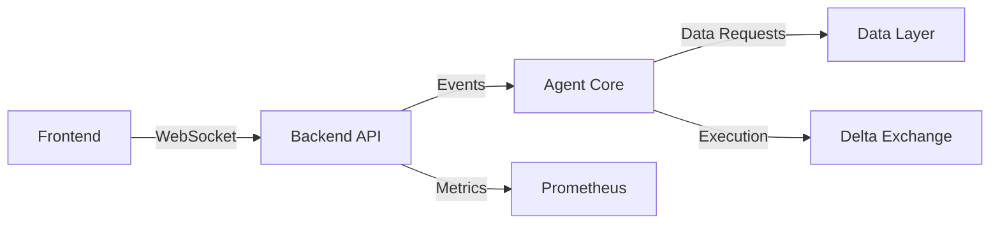

# AI Trading Agent - Complete Rebuild Specification
## Master Prompt for Cursor.ai

> **Purpose:** This document serves as the master specification for rebuilding the Kubera Pokisham AI Trading Agent from scratch. It will guide the creation of multiple linked specification files that together define a production-ready AI trading agent for Delta Exchange India paper trading.

---

## 🎯 PROJECT OBJECTIVES

### Core Mission
Build a functional AI-powered trading agent (not just a bot) that:
1. **Autonomously analyzes** market data using ML models
2. **Makes intelligent decisions** based on multi-model consensus
3. **Executes trades** with proper risk management
4. **Learns and adapts** from trading outcomes
5. **Communicates status** clearly through integrated interfaces

### Critical Requirements
- **Paper trading only** on Delta Exchange India (BTCUSD initially)
- **Reliable frontend-backend integration** with real-time communication
- **True AI agent behavior** with autonomous decision-making capabilities
- **Comprehensive monitoring** with health checks and degradation detection
- **Production-ready code** with proper error handling and logging

---

## 📋 CURSOR INSTRUCTIONS

### Phase 1: Generate Specification Files

**Cursor, please create the following specification files in the `docs/rebuild/` directory:**

#### File 1: `01-architecture-specification.md`
```markdown
# Architecture Specification

## System Overview
- Three-tier architecture: Data Layer → Intelligence Layer → Presentation Layer
- Event-driven communication using WebSockets and message queues
- Microservices design with clear service boundaries

## Component Definitions

### 1. Data Layer
- **Market Data Service**: Real-time and historical data ingestion from Delta Exchange
- **Feature Store**: Computed technical indicators and ML features
- **State Management**: Portfolio, positions, and trade history
- **Time-Series Database**: TimescaleDB for efficient time-series queries

### 2. Intelligence Layer (AI Agent Core)
- **Signal Generation Engine**: Multi-model ML inference system
- **Decision Engine**: Consensus-based trade decision logic
- **Risk Manager**: Circuit breakers, position sizing, and risk metrics
- **Learning Module**: Performance tracking and model feedback loop

### 3. Presentation Layer
- **FastAPI Backend**: REST API and WebSocket server
- **Next.js Frontend**: Real-time dashboard with live updates
- **Telegram Interface**: Mobile notifications and commands
- **Monitoring Stack**: Prometheus + Grafana

## Integration Points
- Delta Exchange API: Market data and order execution
- Internal WebSocket: Real-time state synchronization
- Redis Cache: Fast feature retrieval and rate limiting
- PostgreSQL/TimescaleDB: Persistent storage

## Communication Protocols


## Error Handling Strategy
- Graceful degradation with clear status reporting
- Circuit breakers at each integration point
- Comprehensive logging with correlation IDs
- Health check endpoints at every service
```

#### File 2: `02-agent-intelligence-specification.md`
```markdown
# AI Agent Intelligence Specification

## Agent Behavior Model

### Autonomous Decision Loop
1. **Observe**: Continuously monitor market conditions
2. **Analyze**: Process data through ML model ensemble
3. **Decide**: Apply consensus logic and risk filters
4. **Act**: Execute trades or hold position
5. **Learn**: Record outcomes and update performance metrics

### Multi-Model Ensemble Design

#### Model Portfolio
- **XGBoost**: Primary predictor for trend identification
- **LightGBM**: Fast inference for short-term signals
- **LSTM**: Sequence learning for pattern recognition
- **Transformer**: Attention-based long-term dependencies
- **Random Forest**: Robust baseline and diversification

#### Consensus Mechanism
```python
# Weighted voting with confidence scoring
def generate_signal(models_output):
    weighted_votes = []
    for model, prediction, confidence in models_output:
        weight = model.performance_score * confidence
        weighted_votes.append((prediction, weight))
    
    # Require 60% weighted consensus
    consensus_threshold = 0.6
    signal_strength = calculate_consensus(weighted_votes)
    
    if signal_strength > consensus_threshold:
        return execute_with_confidence(signal_strength)
    else:
        return hold_position()
```

### Decision Framework

#### Signal Classification
- **STRONG_BUY**: 80%+ model agreement, high confidence
- **BUY**: 60-80% agreement, medium confidence
- **HOLD**: <60% agreement or conflicting signals
- **SELL**: 60-80% agreement for short, medium confidence
- **STRONG_SELL**: 80%+ agreement for short, high confidence

#### Risk-Adjusted Execution
- Position size scales with signal strength
- Maximum position: 10% of portfolio per trade
- Kelly Criterion for optimal sizing
- Volatility-adjusted stop losses

### Learning and Adaptation

#### Performance Tracking
- Win rate by signal strength
- Average return by model contribution
- Drawdown attribution per model
- Prediction accuracy metrics

#### Model Weight Adjustment
```python
# Dynamic weight adjustment based on recent performance
def update_model_weights(performance_window=100):
    for model in ensemble:
        recent_trades = get_trades_involving_model(model, window=performance_window)
        accuracy = calculate_accuracy(recent_trades)
        sharpe = calculate_sharpe(recent_trades)
        
        # Exponential moving average of performance
        model.weight = 0.7 * model.weight + 0.3 * (accuracy * sharpe)
        
        # Minimum weight to keep model active
        model.weight = max(model.weight, 0.05)
```

## Agent State Machine

### States
1. **INITIALIZING**: Loading models and connecting to services
2. **MONITORING**: Observing market, no active positions
3. **ANALYZING**: Processing signals, evaluating entry
4. **TRADING**: Active position, monitoring exit conditions
5. **LEARNING**: Post-trade analysis and model updates
6. **DEGRADED**: Partial functionality due to errors
7. **EMERGENCY**: Critical failure, no trading allowed

### State Transitions
- Clear conditions for each transition
- Automatic recovery from DEGRADED when services restore
- Manual override to exit EMERGENCY state
- Health checks determine state validity
```

#### File 3: `03-backend-api-specification.md`
```markdown
# Backend API Specification

## FastAPI Application Structure

### Core Modules
```
backend/
├── api/
│   ├── main.py                 # FastAPI app initialization
│   ├── routes/
│   │   ├── health.py           # Health and status endpoints
│   │   ├── trading.py          # Trading operations
│   │   ├── portfolio.py        # Portfolio queries
│   │   ├── market.py           # Market data
│   │   └── admin.py            # Manual controls
│   ├── middleware/
│   │   ├── auth.py             # JWT authentication
│   │   ├── rate_limit.py       # Rate limiting
│   │   ├── cors.py             # CORS configuration
│   │   └── logging.py          # Request logging
│   ├── models/
│   │   ├── requests.py         # Pydantic request models
│   │   └── responses.py        # Pydantic response models
│   └── websocket/
│       └── manager.py          # WebSocket connection manager
├── services/
│   ├── agent_service.py        # Agent communication
│   ├── market_service.py       # Market data fetching
│   └── portfolio_service.py    # Portfolio calculations
└── core/
    ├── config.py               # Configuration management
    ├── database.py             # Database connection
    └── redis.py                # Redis connection
```

## REST API Endpoints

### Health & Status
```python
@router.get("/api/v1/health")
async def health_check():
    """
    Returns comprehensive health status of all services
    
    Response:
    {
        "status": "healthy" | "degraded" | "unhealthy",
        "services": {
            "database": {"status": "up", "latency_ms": 5},
            "redis": {"status": "up", "latency_ms": 2},
            "agent": {"status": "up", "state": "MONITORING"},
            "delta_exchange": {"status": "up", "latency_ms": 150}
        },
        "agent_state": "MONITORING",
        "timestamp": "2025-11-12T10:30:00Z"
    }
    """
```

### Trading Operations
```python
@router.post("/api/v1/predict")
async def get_prediction():
    """
    Request AI prediction for current market conditions
    
    Response:
    {
        "signal": "BUY" | "SELL" | "HOLD",
        "confidence": 0.75,
        "models": [
            {"name": "xgboost", "prediction": "BUY", "confidence": 0.8},
            {"name": "lstm", "prediction": "BUY", "confidence": 0.7}
        ],
        "reasoning": "Strong uptrend with volume confirmation",
        "suggested_position_size": 0.05,
        "timestamp": "2025-11-12T10:30:00Z"
    }
    """

@router.post("/api/v1/trade/execute")
async def execute_trade(request: TradeRequest):
    """
    Execute a trade (manual or agent-initiated)
    
    Request:
    {
        "symbol": "BTCUSD",
        "side": "buy" | "sell",
        "position_size": 0.05,
        "order_type": "market" | "limit",
        "price": 50000.0  # For limit orders
    }
    
    Response:
    {
        "order_id": "abc123",
        "status": "filled" | "pending" | "rejected",
        "executed_price": 50100.0,
        "quantity": 0.05,
        "timestamp": "2025-11-12T10:30:00Z"
    }
    """
```

### Portfolio Management
```python
@router.get("/api/v1/portfolio/status")
async def get_portfolio():
    """
    Get current portfolio status
    
    Response:
    {
        "total_value": 100000.0,
        "cash": 95000.0,
        "positions_value": 5000.0,
        "unrealized_pnl": 500.0,
        "realized_pnl": 1500.0,
        "positions": [
            {
                "symbol": "BTCUSD",
                "quantity": 0.1,
                "entry_price": 49000.0,
                "current_price": 50000.0,
                "unrealized_pnl": 100.0
            }
        ]
    }
    """

@router.get("/api/v1/portfolio/performance")
async def get_performance():
    """
    Get portfolio performance metrics
    
    Response:
    {
        "total_return": 0.02,
        "sharpe_ratio": 1.5,
        "sortino_ratio": 2.1,
        "max_drawdown": 0.05,
        "win_rate": 0.65,
        "total_trades": 150,
        "avg_trade_return": 0.015
    }
    """
```

## WebSocket Protocol

### Connection
```javascript
const ws = new WebSocket('ws://localhost:8000/ws');
```

### Message Types

#### Server → Client
```typescript
// Agent state update
{
    "type": "agent_state",
    "data": {
        "state": "ANALYZING",
        "message": "Processing new market data"
    }
}

// New trade executed
{
    "type": "trade_executed",
    "data": {
        "order_id": "abc123",
        "symbol": "BTCUSD",
        "side": "buy",
        "price": 50000.0,
        "quantity": 0.05
    }
}

// Portfolio update
{
    "type": "portfolio_update",
    "data": {
        "total_value": 100500.0,
        "unrealized_pnl": 500.0
    }
}

// Health status change
{
    "type": "health_status",
    "data": {
        "status": "degraded",
        "reason": "Delta Exchange API latency high"
    }
}
```

#### Client → Server
```typescript
// Subscribe to updates
{
    "action": "subscribe",
    "channels": ["trades", "portfolio", "agent_state"]
}

// Request current state
{
    "action": "get_state"
}
```

## Error Handling

### Standard Error Response
```python
{
    "error": {
        "code": "TRADE_REJECTED",
        "message": "Insufficient balance",
        "details": {
            "required": 5000.0,
            "available": 3000.0
        },
        "timestamp": "2025-11-12T10:30:00Z",
        "request_id": "req_xyz789"
    }
}
```

### HTTP Status Codes
- 200: Success
- 400: Bad request (invalid parameters)
- 401: Unauthorized (invalid API key)
- 403: Forbidden (operation not allowed in current state)
- 429: Too many requests (rate limit exceeded)
- 500: Internal server error
- 503: Service unavailable (degraded state)
```

#### File 4: `04-frontend-specification.md`
```markdown
# Frontend Dashboard Specification

## Next.js Application Structure

### Directory Layout
```
frontend_web/
├── app/
│   ├── layout.tsx              # Root layout
│   ├── page.tsx                # Main dashboard
│   ├── api/                    # API routes (if needed)
│   └── components/
│       ├── Dashboard.tsx       # Main dashboard container
│       ├── AgentStatus.tsx     # Agent state indicator
│       ├── PortfolioSummary.tsx
│       ├── ActivePositions.tsx
│       ├── RecentTrades.tsx
│       ├── SignalIndicator.tsx
│       ├── PerformanceChart.tsx
│       └── HealthMonitor.tsx
├── hooks/
│   ├── useWebSocket.ts         # WebSocket connection hook
│   ├── useAgent.ts             # Agent state management
│   └── usePortfolio.ts         # Portfolio data hook
├── services/
│   ├── api.ts                  # API client
│   └── websocket.ts            # WebSocket client
├── types/
│   └── index.ts                # TypeScript types
└── utils/
    ├── formatters.ts           # Data formatting
    └── calculations.ts         # Client-side calculations
```

## Core Components

### AgentStatus Component
```typescript
interface AgentStatusProps {
    state: 'MONITORING' | 'ANALYZING' | 'TRADING' | 'DEGRADED' | 'EMERGENCY';
    lastUpdate: Date;
    message?: string;
}

export function AgentStatus({ state, lastUpdate, message }: AgentStatusProps) {
    const statusConfig = {
        MONITORING: { color: 'green', icon: '👁️', text: 'Monitoring Markets' },
        ANALYZING: { color: 'blue', icon: '🧠', text: 'Analyzing Signals' },
        TRADING: { color: 'orange', icon: '⚡', text: 'Active Trade' },
        DEGRADED: { color: 'yellow', icon: '⚠️', text: 'Degraded Performance' },
        EMERGENCY: { color: 'red', icon: '🚨', text: 'Emergency Stop' }
    };
    
    return (
        <div className={`status-card status-${statusConfig[state].color}`}>
            <span className="status-icon">{statusConfig[state].icon}</span>
            <div>
                <h3>{statusConfig[state].text}</h3>
                <p className="text-sm">{message || 'System operational'}</p>
                <p className="text-xs">Last update: {formatTime(lastUpdate)}</p>
            </div>
        </div>
    );
}
```

### SignalIndicator Component
```typescript
interface Signal {
    direction: 'BUY' | 'SELL' | 'HOLD';
    confidence: number;
    models: ModelPrediction[];
    reasoning: string;
}

export function SignalIndicator({ signal }: { signal: Signal }) {
    return (
        <div className="signal-card">
            <div className={`signal-badge signal-${signal.direction.toLowerCase()}`}>
                {signal.direction}
            </div>
            <div className="confidence-bar">
                <div 
                    className="confidence-fill"
                    style={{ width: `${signal.confidence * 100}%` }}
                />
            </div>
            <p className="confidence-text">
                Confidence: {(signal.confidence * 100).toFixed(1)}%
            </p>
            <details className="reasoning">
                <summary>Model Consensus</summary>
                <ul>
                    {signal.models.map(m => (
                        <li key={m.name}>
                            {m.name}: {m.prediction} ({m.confidence.toFixed(2)})
                        </li>
                    ))}
                </ul>
                <p>{signal.reasoning}</p>
            </details>
        </div>
    );
}
```

### HealthMonitor Component
```typescript
interface HealthStatus {
    status: 'healthy' | 'degraded' | 'unhealthy';
    services: {
        [key: string]: {
            status: 'up' | 'down' | 'degraded';
            latency_ms?: number;
        };
    };
}

export function HealthMonitor({ health }: { health: HealthStatus }) {
    return (
        <div className="health-monitor">
            <h3>System Health</h3>
            <div className={`overall-status status-${health.status}`}>
                {health.status.toUpperCase()}
            </div>
            <div className="services-grid">
                {Object.entries(health.services).map(([name, service]) => (
                    <div key={name} className="service-status">
                        <span className={`indicator indicator-${service.status}`} />
                        <span>{name}</span>
                        {service.latency_ms && (
                            <span className="latency">{service.latency_ms}ms</span>
                        )}
                    </div>
                ))}
            </div>
        </div>
    );
}
```

## WebSocket Integration

### Custom Hook
```typescript
export function useWebSocket(url: string) {
    const [isConnected, setIsConnected] = useState(false);
    const [lastMessage, setLastMessage] = useState<any>(null);
    const ws = useRef<WebSocket | null>(null);
    
    useEffect(() => {
        // Connect to WebSocket
        ws.current = new WebSocket(url);
        
        ws.current.onopen = () => {
            setIsConnected(true);
            // Subscribe to channels
            ws.current?.send(JSON.stringify({
                action: 'subscribe',
                channels: ['trades', 'portfolio', 'agent_state', 'health']
            }));
        };
        
        ws.current.onmessage = (event) => {
            const message = JSON.parse(event.data);
            setLastMessage(message);
        };
        
        ws.current.onerror = (error) => {
            console.error('WebSocket error:', error);
            setIsConnected(false);
        };
        
        ws.current.onclose = () => {
            setIsConnected(false);
            // Attempt reconnection after 5 seconds
            setTimeout(() => {
                if (ws.current?.readyState === WebSocket.CLOSED) {
                    // Reconnect logic
                }
            }, 5000);
        };
        
        return () => {
            ws.current?.close();
        };
    }, [url]);
    
    const sendMessage = useCallback((message: any) => {
        if (ws.current?.readyState === WebSocket.OPEN) {
            ws.current.send(JSON.stringify(message));
        }
    }, []);
    
    return { isConnected, lastMessage, sendMessage };
}
```

## Real-Time Updates

### Message Handling
```typescript
export function Dashboard() {
    const { lastMessage } = useWebSocket('ws://localhost:8000/ws');
    const [agentState, setAgentState] = useState('MONITORING');
    const [portfolio, setPortfolio] = useState(null);
    const [recentTrades, setRecentTrades] = useState([]);
    
    useEffect(() => {
        if (!lastMessage) return;
        
        switch (lastMessage.type) {
            case 'agent_state':
                setAgentState(lastMessage.data.state);
                break;
            case 'portfolio_update':
                setPortfolio(lastMessage.data);
                break;
            case 'trade_executed':
                setRecentTrades(prev => [lastMessage.data, ...prev].slice(0, 10));
                break;
            case 'health_status':
                // Handle health status changes
                break;
        }
    }, [lastMessage]);
    
    return (
        <div className="dashboard">
            <AgentStatus state={agentState} />
            <PortfolioSummary portfolio={portfolio} />
            <RecentTrades trades={recentTrades} />
        </div>
    );
}
```

## Styling Requirements

- Clean, modern design with dark mode support
- Responsive layout (mobile-friendly)
- Real-time animations for updates
- Color-coded status indicators
- Loading states and skeletons
- Error boundaries for component failures
```

#### File 5: `05-integration-specification.md`
```markdown
# System Integration Specification

## Critical Integration Points

### 1. Backend ↔ Agent Communication

#### Message Queue Pattern
```python
# backend/services/agent_service.py
from queue import Queue
import asyncio

class AgentService:
    def __init__(self):
        self.command_queue = Queue()
        self.response_queue = Queue()
        self.agent_state = "INITIALIZING"
    
    async def send_command(self, command: dict):
        """Send command to agent and wait for response"""
        self.command_queue.put(command)
        
        # Wait for response with timeout
        try:
            response = await asyncio.wait_for(
                self._get_response(),
                timeout=5.0
            )
            return response
        except asyncio.TimeoutError:
            return {"error": "Agent did not respond"}
    
    async def _get_response(self):
        while True:
            if not self.response_queue.empty():
                return self.response_queue.get()
            await asyncio.sleep(0.1)
```

### 2. Frontend ↔ Backend Connection

#### Robust WebSocket Client
```typescript
// frontend_web/services/websocket.ts
export class RobustWebSocket {
    private ws: WebSocket | null = null;
    private reconnectAttempts = 0;
    private maxReconnectAttempts = 10;
    private reconnectDelay = 1000;
    private messageHandlers: Map<string, Function[]> = new Map();
    
    constructor(private url: string) {
        this.connect();
    }
    
    private connect() {
        this.ws = new WebSocket(this.url);
        
        this.ws.onopen = () => {
            console.log('WebSocket connected');
            this.reconnectAttempts = 0;
            this.reconnectDelay = 1000;
            
            // Re-subscribe to channels
            this.resubscribe();
        };
        
        this.ws.onmessage = (event) => {
            const message = JSON.parse(event.data);
            this.handleMessage(message);
        };
        
        this.ws.onerror = (error) => {
            console.error('WebSocket error:', error);
        };
        
        this.ws.onclose = () => {
            console.log('WebSocket closed');
            this.attemptReconnect();
        };
    }
    
    private attemptReconnect() {
        if (this.reconnectAttempts < this.maxReconnectAttempts) {
            this.reconnectAttempts++;
            console.log(`Reconnecting... Attempt ${this.reconnectAttempts}`);
            
            setTimeout(() => {
                this.connect();
            }, this.reconnectDelay);
            
            // Exponential backoff
            this.reconnectDelay = Math.min(this.reconnectDelay * 2, 30000);
        }
    }
    
    public on(messageType: string, handler: Function) {
        if (!this.messageHandlers.has(messageType)) {
            this.messageHandlers.set(messageType, []);
        }
        this.messageHandlers.get(messageType)!.push(handler);
    }
    
    private handleMessage(message: any) {
        const handlers = this.messageHandlers.get(message.type);
        if (handlers) {
            handlers.forEach(handler => handler(message.data));
        }
    }
}
```

### 3. Agent ↔ Delta Exchange

#### Retry Logic with Circuit Breaker
```python
# src/data/delta_client.py
from typing import Optional
import time

class DeltaExchangeClient:
    def __init__(self):
        self.circuit_open = False
        self.failure_count = 0
        self.last_failure_time = 0
        self.failure_threshold = 5
        self.circuit_timeout = 60  # seconds
    
    async def fetch_ticker(self, symbol: str) -> Optional[dict]:
        """Fetch ticker with circuit breaker"""
        if self.circuit_open:
            if time.time() - self.last_failure_time > self.circuit_timeout:
                # Try to close circuit
                self.circuit_open = False
                self.failure_count = 0
            else:
                return None
        
        try:
            response = await self._make_request(f"/ticker/{symbol}")
            self.failure_count = 0  # Reset on success
            return response
        except Exception as e:
            self.failure_count += 1
            self.last_failure_time = time.time()
            
            if self.failure_count >= self.failure_threshold:
                self.circuit_open = True
                logger.error("Circuit breaker opened for Delta Exchange")
            
            raise
```

### 4. Health Check System

#### Comprehensive Health Checks
```python
# backend/api/routes/health.py
from fastapi import APIRouter
from typing import Dict

router = APIRouter()

@router.get("/api/v1/health")
async def comprehensive_health_check() -> Dict:
    checks = {
        "database": await check_database(),
        "redis": await check_redis(),
        "agent": await check_agent(),
        "delta_exchange": await check_delta_exchange()
    }
    
    # Determine overall status
    if all(c["status"] == "up" for c in checks.values()):
        overall = "healthy"
    elif any(c["status"] == "down" for c in checks.values()):
        overall = "unhealthy"
    else:
        overall = "degraded"
    
    return {
        "status": overall,
        "services": checks,
        "timestamp": datetime.utcnow().isoformat()
    }

async def check_database() -> Dict:
    try:
        start = time.time()
        await db.execute("SELECT 1")
        latency = (time.time() - start) * 1000
        return {"status": "up", "latency_ms": round(latency, 2)}
    except Exception as e:
        return {"status": "down", "error": str(e)}

async def check_agent() -> Dict:
    try:
        # Check if agent is responding
        response = await agent_service.ping()
        return {
            "status": "up",
            "state": response.get("state"),
            "last_heartbeat": response.get("timestamp")
        }
    except Exception as e:
        return {"status": "down", "error": str(e)}
```

## Error Recovery Procedures

### Automatic Recovery
```python
# src/core/recovery.py
class RecoveryManager:
    async def handle_degradation(self, service: str, error: Exception):
        """Handle service degradation"""
        logger.warning(f"Service degraded: {service} - {error}")
        
        # Notify monitoring
        await metrics.increment("service_degraded", tags={"service": service})
        
        # Attempt recovery based on service
        recovery_strategies = {
            "delta_exchange": self.recover_delta_exchange,
            "database": self.recover_database,
            "redis": self.recover_redis
        }
        
        if service in recovery_strategies:
            await recovery_strategies[service]()
    
    async def recover_delta_exchange(self):
        """Attempt to recover Delta Exchange connection"""
        for attempt in range(3):
            try:
                await delta_client.reconnect()
                logger.info("Delta Exchange connection recovered")
                return True
            except Exception as e:
                logger.error(f"Recovery attempt {attempt + 1} failed: {e}")
                await asyncio.sleep(5 * (attempt + 1))
        
        return False
```

## Testing Integration

### Integration Test Suite
```python
# tests/integration/test_full_stack.py
import pytest

@pytest.mark.integration
async def test_end_to_end_prediction():
    """Test complete flow from API request to agent response"""
    # 1. Call prediction endpoint
    response = await api_client.post("/api/v1/predict")
    assert response.status_code == 200
    
    # 2. Verify agent processed request
    prediction = response.json()
    assert "signal" in prediction
    assert "confidence" in prediction
    assert len(prediction["models"]) > 0
    
    # 3. Check WebSocket broadcast
    ws_message = await websocket_client.receive()
    assert ws_message["type"] == "prediction_generated"

@pytest.mark.integration
async def test_health_check_accuracy():
    """Verify health checks reflect actual service state"""
    # Stop Redis temporarily
    await redis.disconnect()
    
    # Health check should detect this
    health = await api_client.get("/api/v1/health")
    assert health.json()["services"]["redis"]["status"] == "down"
    assert health.json()["status"] in ["degraded", "unhealthy"]
    
    # Restart Redis
    await redis.connect()
    
    # Health should recover
    health = await api_client.get("/api/v1/health")
    assert health.json()["services"]["redis"]["status"] == "up"
```
```

#### File 6: `06-implementation-checklist.md`
```markdown
# Implementation Checklist

## Phase 1: Foundation (Week 1)

### Day 1-2: Project Setup
- [ ] Create new project directory structure
- [ ] Set up Python virtual environment
- [ ] Install core dependencies (FastAPI, SQLAlchemy, Redis, etc.)
- [ ] Initialize Git repository with proper .gitignore
- [ ] Create .env.example with all required variables
- [ ] Set up TimescaleDB/PostgreSQL database
- [ ] Configure Redis instance

### Day 3-4: Core Backend
- [ ] Implement FastAPI application structure
- [ ] Create database models and migrations
- [ ] Build health check endpoints with actual service checks
- [ ] Implement WebSocket manager with reconnection logic
- [ ] Set up CORS middleware properly
- [ ] Add request logging middleware
- [ ] Create API response models with Pydantic

### Day 5-7: Agent Core
- [ ] Implement agent state machine
- [ ] Create ML model loading system
- [ ] Build ensemble prediction logic
- [ ] Implement decision engine
- [ ] Add risk management module
- [ ] Create Delta Exchange client with circuit breaker
- [ ] Set up agent-backend communication channel

## Phase 2: Intelligence (Week 2)

### Day 8-10: ML Pipeline
- [ ] Implement feature engineering pipeline
- [ ] Create model training scripts
- [ ] Build ensemble manager
- [ ] Add model performance tracking
- [ ] Implement dynamic weight adjustment
- [ ] Set up model artifact storage

### Day 11-14: Trading Logic
- [ ] Implement paper trading executor
- [ ] Create order management system
- [ ] Build position tracking
- [ ] Add PnL calculation
- [ ] Implement risk checks (circuit breakers)
- [ ] Create trade logging system

## Phase 3: Frontend (Week 3)

### Day 15-17: Next.js Setup
- [ ] Initialize Next.js project with TypeScript
- [ ] Set up Tailwind CSS
- [ ] Create layout components
- [ ] Implement WebSocket hook
- [ ] Build API service layer
- [ ] Add error boundaries

### Day 18-21: Dashboard Components
- [ ] Create AgentStatus component
- [ ] Build PortfolioSummary component
- [ ] Implement ActivePositions component
- [ ] Create SignalIndicator component
- [ ] Build HealthMonitor component
- [ ] Add PerformanceChart component
- [ ] Implement RecentTrades component

## Phase 4: Integration (Week 4)

### Day 22-24: Backend-Frontend Integration
- [ ] Test WebSocket connection
- [ ] Verify API endpoint responses
- [ ] Test real-time updates
- [ ] Implement error handling
- [ ] Add loading states
- [ ] Test reconnection logic

### Day 25-26: Agent-Backend Integration
- [ ] Test command/response flow
- [ ] Verify health check accuracy
- [ ] Test degraded state handling
- [ ] Implement recovery procedures
- [ ] Add integration tests

### Day 27-28: End-to-End Testing
- [ ] Run full system tests
- [ ] Test degradation scenarios
- [ ] Verify health check accuracy
- [ ] Test WebSocket stability
- [ ] Performance testing
- [ ] Fix identified issues

## Phase 5: Monitoring & Polish (Week 5)

### Day 29-30: Monitoring Setup
- [ ] Set up Prometheus metrics
- [ ] Configure Grafana dashboards
- [ ] Create alert rules
- [ ] Implement structured logging
- [ ] Add log rotation

### Day 31-32: Telegram Integration
- [ ] Create Telegram bot
- [ ] Implement command handlers
- [ ] Add notification system
- [ ] Test bot commands
- [ ] Document bot usage

### Day 33-35: Documentation & Cleanup
- [ ] Write setup guide
- [ ] Create API documentation
- [ ] Document deployment procedures
- [ ] Write troubleshooting guide
- [ ] Clean up code and comments
- [ ] Final testing and validation

## Validation Criteria

### Backend Health
- [ ] All health checks return accurate status
- [ ] WebSocket connections are stable
- [ ] API responds within 100ms for most requests
- [ ] Error responses are properly formatted
- [ ] Logging is comprehensive and structured

### Agent Functionality
- [ ] Agent makes predictions reliably
- [ ] Risk checks work correctly
- [ ] Paper trades execute properly
- [ ] State machine transitions correctly
- [ ] Recovery from degraded state works

### Frontend Experience
- [ ] Dashboard updates in real-time
- [ ] All components render correctly
- [ ] WebSocket reconnects automatically
- [ ] Error states are handled gracefully
- [ ] Loading states are clear

### Integration Quality
- [ ] No "degraded" status without reason
- [ ] Health checks reflect actual state
- [ ] Frontend receives all backend events
- [ ] Agent responds to backend commands
- [ ] Recovery procedures work automatically

## Success Metrics
- System uptime > 99% during testing period
- API latency p95 < 200ms
- WebSocket message delivery > 99.9%
- Agent prediction latency < 1 second
- Zero silent failures (all errors logged and visible)
```

---

## 🔧 IMPLEMENTATION INSTRUCTIONS FOR CURSOR

### Step 1: Create All Specification Files
```bash
# Create the rebuild directory
mkdir -p docs/rebuild

# Cursor will create these files:
docs/rebuild/01-architecture-specification.md
docs/rebuild/02-agent-intelligence-specification.md
docs/rebuild/03-backend-api-specification.md
docs/rebuild/04-frontend-specification.md
docs/rebuild/05-integration-specification.md
docs/rebuild/06-implementation-checklist.md
```

### Step 2: Generate Root Implementation Plan
Create `docs/rebuild/00-implementation-plan.md` that:
- Links to all specification files
- Provides build order
- Defines success criteria
- Includes testing requirements

### Step 3: Start Implementation
Follow the checklist in `06-implementation-checklist.md`, implementing each component according to its specification file.

### Step 4: Validate Integration
After each phase, run integration tests to ensure components work together properly.

---

## 🎯 KEY SUCCESS FACTORS

1. **No Silent Failures**: Every error must be logged and visible in health checks
2. **Real Health Checks**: Health endpoints must actually test service availability
3. **Robust WebSockets**: Automatic reconnection with exponential backoff
4. **Clear State Machine**: Agent state must always be deterministic and observable
5. **Comprehensive Testing**: Integration tests for all critical paths

---

## 🚨 CRITICAL FIXES FOR PREVIOUS ISSUES

### Issue 1: "Bot Degraded" Status
**Root Cause**: Health checks not actually testing services
**Fix**: Implement real health checks that ping services and measure latency

### Issue 2: Frontend-Backend Communication
**Root Cause**: WebSocket connections dropping without reconnection
**Fix**: Robust WebSocket client with automatic reconnection and exponential backoff

### Issue 3: Integration Errors
**Root Cause**: Lack of error handling and circuit breakers
**Fix**: Circuit breakers at every integration point with automatic recovery

### Issue 4: Not Acting Like AI Agent
**Root Cause**: Simple rule-based logic instead of intelligent decision-making
**Fix**: Multi-model ensemble with consensus mechanism and learning feedback loop

---

## 📝 NOTES FOR CURSOR

- Follow the specifications exactly as written
- Implement comprehensive error handling at every layer
- Add extensive logging with correlation IDs
- Create integration tests as you build
- Document assumptions and design decisions
- Focus on reliability over features

---

## 🏁 FINAL OUTPUT STRUCTURE

After Cursor completes implementation, you should have:

```
Trading-Agent/
├── docs/rebuild/
│   ├── 00-implementation-plan.md       (Root linking doc)
│   ├── 01-architecture-specification.md
│   ├── 02-agent-intelligence-specification.md
│   ├── 03-backend-api-specification.md
│   ├── 04-frontend-specification.md
│   ├── 05-integration-specification.md
│   └── 06-implementation-checklist.md
├── backend/                             (Rebuilt backend)
├── frontend_web/                        (Rebuilt frontend)
├── src/                                 (Rebuilt agent core)
├── tests/                               (Integration tests)
└── scripts/                             (Deployment scripts)
```

---

**START CURSOR IMPLEMENTATION WITH:**
```
Cursor, please create all 6 specification files in docs/rebuild/ as detailed above, 
then create the implementation plan (00-implementation-plan.md) that links them all 
together. After that, begin implementing Phase 1 from the checklist.
```
